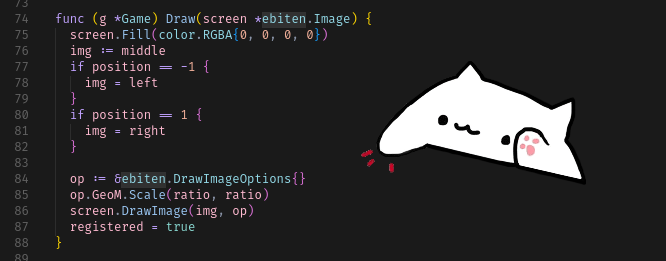

# BonGOcat

Who never needed to have a bongo cat on their desktop?
I know I did, so I made one.



## Installation

```bash
make build
```

## Usage

```bash
./dist/bongo <size>
```

## Example

```bash
./dist/bongo 0.5
```
